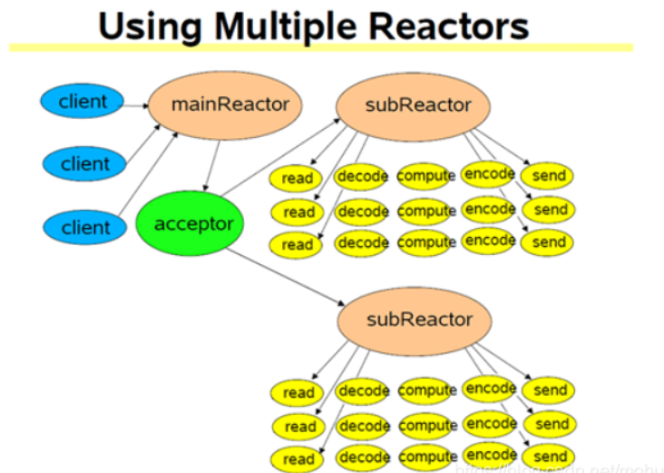

**记录一下学习muduo库的过程**

### 一、前置知识：阻塞、非阻塞、同步、异步

#### 1.1 典型的一次IO的两个阶段

##### 1.1.1 数据准备

根据系统IO操作的就绪状态

+ 阻塞：调用IO方法的线程进入阻塞状态。

+ 非阻塞：不会进入阻塞状态，通过IO函数的返回值判断数据是否准备好。

```C
int size = recv(sockfd, buf, 1024, 0);

size == -1						发生错误
size == -1 && errno == EAGAIN	连接正常，数据还没有准备好 或者用 EWOULDBLOCK
size == 0						对端关闭了网络链接
size > 0						数据准备好了，返回数据的大小
```

##### 1.1.2 数据读写

根据应用程序和内核的交互方式

+ IO同步：请求进程会阻塞直到IO操作完成。
+ IO异步：不导致请求进程阻塞。请求进程使用异步的IO函数，告诉内核需要监听的事件以及完成IO操作后如何通知我们，内核会监听并处理数据，直到IO完成，通知请求进程。

**在处理 IO 的时候，阻塞和非阻塞都是同步 IO。只有使用了特殊的 API 才是异步IO（如linux中的 AIO）**


注意：区分IO的同步和异步 和 并发的同步和异步

>  **业务层面的一个逻辑处理是同步还是异步？**
>
> 同步：A操作等待B操作做完事情，得到返回值，继续处理
>
> 异步：A操作告诉B它感兴趣的事件以及通知方式，A操作继续执行自己的业务逻辑。当B监听到相应事件发生后，B会通知A，A开始相应的数据处理逻辑。


##### 1.1.3 总结

阻塞、非阻塞、同步、异步描述的都是一个IO的状态。一个典型的IO包含两个阶段：数据准备（就绪）和数据读写阶段。

+ 以 recv 函数为例。

+ 数据就绪

  数据就绪就是远端有没有数据过来，也就是内核中相应的 sockfd 中的TCP接收缓冲区是否有数据可读。

  + 当 sockfd 工作在阻塞模式下的话，在调用 recv 的时候，如果数据没有就绪，recv会阻塞当前的进程。

  + 如果 sockfd 工作在非阻塞模式下的话，在调用 recv 的时候，如果数据没有就绪，recv 会立即返回。那么我们如何判断 recv 的非阻塞状态呢？通过查看返回值：

```C
int size = recv(sockfd, buf, 1024, 0);

size == -1						发生错误
size == -1 && errno == EAGAIN	连接正常，数据还没有准备好 或者用 EWOULDBLOCK
size == 0						对端关闭了网络链接
size > 0						数据准备好了，返回数据的大小
```

+ 数据读写

  如果数据就绪了，那么IO就进入数据读写阶段。

  + 如果使用的是同步IO，比如说 recv。那么 recv 会从内核的 TCP 接收缓冲区中将数据拷贝到用户态。这个过程中当前进程会阻塞。
  + 如果使用的是异步IO，那么需要使用系统的异步IO接口。我们需要传入 sockfd、缓冲区指针、缓冲区大小并告诉内核整个IO操作完成后如何通知我们（信号或回调等）。内核会负责监听 TCP 的接收缓冲区是否有数据可读，如果有内核负责将数据拷贝到用户态，完成后通知进程处理数据。与同步IO不同，异步IO不会导致请求进程阻塞。


##### 1.1.4 五种IO模型

###### 1.1.4.1 阻塞IO模型


###### 1.1.4.2 非阻塞IO模型


###### 1.1.4.3 IO复用模型


###### 1.1.4.4 信号驱动式IO模型


###### 1.1.4.5 异步IO


###### 1.1.4.6 各种IO模型比较


#### 1.2 良好的网络服务器该怎么设计

> 在这个多核时代，服务端网络编程如何选择线程模型呢？ 赞同libev作者的观点：**one loop per thread is usually a good model**，这样多线程服务端编程的问题就转换为如何设计一个高效且易于使用的event loop，然后每个线程run一个event loop就行了（当然线程间的同步、互斥少不了，还有其它的耗时事件需要起另外的线程来做）。


##### 1.2.1 非阻塞IO + IO复用

**为什么使用 非阻塞IO + IO复用？**

+ 单用非阻塞IO：进程会不段轮询内核，查看某个操作是否就绪。这么做会耗费大量的CPU资源。
+ IO复用+阻塞IO：read()/write()/accept()/connect() 都有可能阻塞当前线程，这样进程就没办法处理其他 socket 上的 IO 事件了。 

[在使用Multiplexed I/O的情况下，还有必要使用Non Blocking I/O么 ? - 知乎 (zhihu.com)](https://www.zhihu.com/question/33072351/answer/55925265)


##### 1.2.2 多进程还是多线程？

**epoll + fork 不如 epoll + pthread 吗？**

错，强大的nginx服务器采用了epoll+fork模型作为网络模块的架构设计，实现了简单好用的负载算法，使各个fork网络进程不会忙的越忙、闲的越闲，并且通过引入一把乐观锁解决了该模型导致的服务器惊群现象，功能十分强大。


#### 1.3 Reactor 模型

> The reactor design pattern is an event handling pattern for handling service requests delivered concurrently to a service handler by one or more inputs. The service handler then demultiplexes the incoming requests and dispatches them synchronously to the associated request handlers.

##### 1.3.1 Reactor 模型的组成

**Reactor 模型由以下几个重要组件组成：Event事件、Reactor反应堆、Demultiplex事件分发器、EvantHandler事件处理器**


+ 首先将事件以及事件处理器注册到 Reactor 反应堆上。请求 Reactor 监听感兴趣的事件，并在事件发生的时候，调用我注册的 Handler 回调。
+ Reactor 维护了一个事件集合。Reactor 通过相应的方法可以将事件添加到 Demutiplex事件分发器中。也可以修改和删除 Demutiplex 中的事件。（Demultiplex 可以看做一个 IO复用）
+ Reactor 启动反映堆后，Demultiplex开启事件循环等待事件到来。
+ 如果有事件发生，Demultiplex 返回发生的事件到 Reactor 中。Reactor 会调用对应事件的 EventHandler 事件处理器并处理该事件。


##### 1.3.2 muduo 库使用的Reactor模型

采用 Multiple Reactor模型

下图将 Reactor 和 Demultiplex 合二为一了。




#### 1.4 epoll

##### 1.4.1 select 和 poll 的缺点

select 的缺点:

1. 单个进程能够监视的文件描述符数量存在最大限制，通常是1024（`#define __FD_SETSIZE 1024`）。当然可以更改数量，但由于 select 采用轮询的方式扫描文件描述符，文件描述符数量越多，性能越差;
2. 内核/用户空间内存拷贝问题，select 需要复制大量的句柄数据结构（文件描述符），产生巨大的开销;
3. select 返回的是含有整个句柄的数组，应用程序需要遍历整个数组才能发现哪些句柄发生了事件;
4. select 的触发方式是水平触发，应用程序如果没有完成对一个已经就绪的文件描述符进程IO操作，那么之后每次 select 调用还是会将这些文件描述符通知进程。

相比 select 模型，poll 使用链表保存文件描述符，因此没有了监视文件数量的限制，但其他三个缺点依然存在。

> 以 select 模型为例，假设我们的服务器需要支持100万的并发连接，则在__FD_SETSIZE 为 1024 的情况下，则我们至少需要开辟1k个进程才能实现100万的并发连接。除了进程间上下文切换的时间消耗外，从内核/用户空间大量的句柄结构内存拷贝、数组轮询等，是系统难以承受的。因此，基于select模型的服务器程序，要达到100万级别的并发访问，是一个很难完成的任务。


##### 1.4.2 epoll 的优势

epoll的实现机制与select/poll机制完全不同，它们的缺点在epoll上不复存在。 

设想一下如下场景：有100万个客户端同时与一个服务器进程保持着TCP连接。而每一时刻，通常只有 几百上千个TCP连接是活跃的(事实上大部分场景都是这种情况)。如何实现这样的高并发？

在select/poll时代，服务器进程每次都把这100万个连接告诉操作系统（从用户态复制句柄数据结构到 内核态），让操作系统内核去查询这些套接字上是否有事件发生，轮询完成后，再将句柄数据复制到用 户态，让服务器应用程序轮询处理已发生的网络事件，这一过程资源消耗较大，因此，select/poll一般 只能处理几千的并发连接。

epoll的设计和实现与select完全不同。epoll通过在Linux内核中申请一个简易的文件系统（文件系统一 般用什么数据结构实现？B+树，磁盘IO消耗低，效率很高）。把原先的select/poll调用分成以下3个部 分： 

1. 调用epoll_create()建立一个epoll对象（在epoll文件系统中为这个句柄对象分配资源）

2. 调用epoll_ctl向epoll对象中添加这100万个连接的套接字 

3. 调用epoll_wait收集发生的事件的fd资源 

如此一来，要实现上面说是的场景，只需要在进程启动时建立一个epoll对象，然后在需要的时候向这 个epoll对象中添加或者删除事件。同时，epoll_wait的效率也非常高，因为调用epoll_wait时，并没有 向操作系统复制这100万个连接的句柄数据，内核也不需要去遍历全部的连接。

epoll_create在内核上创建的eventpoll结构如下：

```C++
struct eventpoll{
....
/*红黑树的根节点，这颗树中存储着所有添加到epoll中的需要监控的事件*/
struct rb_root rbr;
/*双链表中则存放着将要通过epoll_wait返回给用户的满足条件的事件*/
struct list_head rdlist;
....
};
```


##### 1.4.3 边缘触发和水平触发

水平触发：当被监控的文件描述符上有可读写事件发生时，会通知用户程序去读写，如果用户一次读写没取完数据，他会一直通知用户，如果这个描述符是用户不关心的，它每次都返回通知用户，则会导致用户对于关心的描述符的处理效率降低。

边缘触发：当被监控的文件描述符上有可读写事件发生时，会通知用户程序去读写，它只会通知用户进程一次，这需要用户一次把内容读取玩，相对于水平触发，效率更高。如果用户一次没有读完数据，再次请求时，不会立即返回，需要等待下一次的新的数据到来时才会返回，这次返回的内容包括上次未取完的数据。

**muduo 采用的是水平触发**：

1. 不会丢失数据或消息
   + 应用没有读取完数据，内核会不断上报
2. 低延迟处理
   + 每次读数据只需要一次系统调用，照顾了多个连接的公平性，不会因为某个连接上的数据量过大而影响其他连接处理消息
3. 跨平台处理
   + 像 select 一样可以跨平台使用


### 二、muduo库的使用

**想要仿写muduo库就必须先学会怎么用**

#### 2.1 编译安装

[C++ muduo网络库知识分享01 - Linux平台下muduo网络库源码编译安装_大秦坑王的博客-CSDN博客](https://blog.csdn.net/QIANGWEIYUAN/article/details/89023980)


#### 2.2 基于muduo的客户端服务器编程

muduo 网络库给用户提供了两个主要的类：

+ TcpServer ：用于编写服务器程序
+ TcpClient ：用于遍写客户端程序

epoll + 线程池：能够很好地把网络IO的代码和业务代码区分开


`_server.setConnectionCallback()`

`_server.setMessageCallback()`

`_server.setThreadNum()`

`_server.start()`

`g++ muduo_server.cpp -o server -lmuduo_net -lmuduo_base -lpthread`


### 三、构建项目编译 CMake 文件


### 四、noncopyable类


