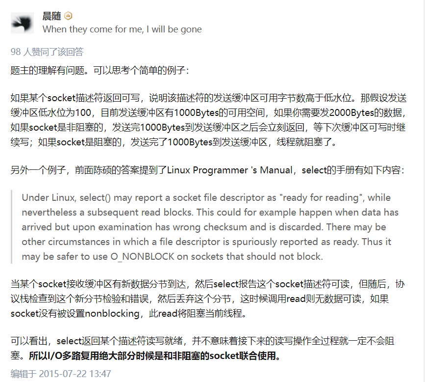

**记录一下学习muduo库的过程**

# 一、前置知识：阻塞、非阻塞、同步、异步

## 1.1 典型的一次IO的两个阶段

### 1.1.1 数据准备

根据系统IO操作的就绪状态

+ 阻塞：调用IO方法的线程进入阻塞状态。

+ 非阻塞：不会进入阻塞状态，通过IO函数的返回值判断数据是否准备好。

```C
int size = recv(sockfd, buf, 1024, 0);

size == -1						发生错误
size == -1 && errno == EAGAIN	连接正常，数据还没有准备好 或者用 EWOULDBLOCK
size == 0						对端关闭了网络链接
size > 0						数据准备好了，返回数据的大小
```

##### 1.1.2 数据读写

根据应用程序和内核的交互方式

+ IO同步：请求进程会阻塞直到IO操作完成。
+ IO异步：不导致请求进程阻塞。请求进程使用异步的IO函数，告诉内核需要监听的事件以及完成IO操作后如何通知我们，内核会监听并处理数据，直到IO完成，通知请求进程。

**在处理 IO 的时候，阻塞和非阻塞都是同步 IO。只有使用了特殊的 API 才是异步IO（如linux中的 AIO）**


注意：区分IO的同步和异步 和 并发的同步和异步

>  **业务层面的一个逻辑处理是同步还是异步？**
>
> 同步：A操作等待B操作做完事情，得到返回值，继续处理
>
> 异步：A操作告诉B它感兴趣的事件以及通知方式，A操作继续执行自己的业务逻辑。当B监听到相应事件发生后，B会通知A，A开始相应的数据处理逻辑。


### 1.1.3 总结

阻塞、非阻塞、同步、异步描述的都是一个IO的状态。一个典型的IO包含两个阶段：数据准备（就绪）和数据读写阶段。

+ 以 recv 函数为例。

+ 数据就绪

  数据就绪就是远端有没有数据过来，也就是内核中相应的 sockfd 中的TCP接收缓冲区是否有数据可读。

  + 当 sockfd 工作在阻塞模式下的话，在调用 recv 的时候，如果数据没有就绪，recv会阻塞当前的进程。

  + 如果 sockfd 工作在非阻塞模式下的话，在调用 recv 的时候，如果数据没有就绪，recv 会立即返回。那么我们如何判断 recv 的非阻塞状态呢？通过查看返回值：

```C
int size = recv(sockfd, buf, 1024, 0);

size == -1						发生错误
size == -1 && errno == EAGAIN	连接正常，数据还没有准备好 或者用 EWOULDBLOCK
size == 0						对端关闭了网络链接
size > 0						数据准备好了，返回数据的大小
```

+ 数据读写

  如果数据就绪了，那么IO就进入数据读写阶段。

  + 如果使用的是同步IO，比如说 recv。那么 recv 会从内核的 TCP 接收缓冲区中将数据拷贝到用户态。这个过程中当前进程会阻塞。
  + 如果使用的是异步IO，那么需要使用系统的异步IO接口。我们需要传入 sockfd、缓冲区指针、缓冲区大小并告诉内核整个IO操作完成后如何通知我们（信号或回调等）。内核会负责监听 TCP 的接收缓冲区是否有数据可读，如果有内核负责将数据拷贝到用户态，完成后通知进程处理数据。与同步IO不同，异步IO不会导致请求进程阻塞。


### 1.1.4 五种IO模型

#### 1.1.4.1 阻塞IO模型


###### 1.1.4.2 非阻塞IO模型


###### 1.1.4.3 IO复用模型


#### 1.1.4.4 信号驱动式IO模型


#### 1.1.4.5 异步IO


#### 1.1.4.6 各种IO模型比较


## 1.2 良好的网络服务器该怎么设计

> 在这个多核时代，服务端网络编程如何选择线程模型呢？ 赞同libev作者的观点：**one loop per thread is usually a good model**，这样多线程服务端编程的问题就转换为如何设计一个高效且易于使用的event loop，然后每个线程run一个event loop就行了（当然线程间的同步、互斥少不了，还有其它的耗时事件需要起另外的线程来做）。


### 1.2.1 非阻塞IO + IO复用

**为什么使用 非阻塞IO + IO复用？**

+ 单用非阻塞IO：进程会不段轮询内核，查看某个操作是否就绪。这么做会耗费大量的CPU资源。
+ IO复用+阻塞IO：read()/write()/accept()/connect() 都有可能阻塞当前线程，这样进程就没办法处理其他 socket 上的 IO 事件了。 

[在使用Multiplexed I/O的情况下，还有必要使用Non Blocking I/O么 ? - 知乎 (zhihu.com)](https://www.zhihu.com/question/33072351/answer/55925265)




### 1.2.2 多进程还是多线程？

**epoll + fork 不如 epoll + pthread 吗？**

错，强大的nginx服务器采用了epoll+fork模型作为网络模块的架构设计，实现了简单好用的负载算法，使各个fork网络进程不会忙的越忙、闲的越闲，并且通过引入一把乐观锁解决了该模型导致的服务器惊群现象，功能十分强大。


## 1.3 Reactor 模型

> The reactor design pattern is an event handling pattern for handling service requests delivered concurrently to a service handler by one or more inputs. The service handler then demultiplexes the incoming requests and dispatches them synchronously to the associated request handlers.

### 1.3.1 Reactor 模型的组成

**Reactor 模型由以下几个重要组件组成：Event事件、Reactor反应堆、Demultiplex事件分发器、EvantHandler事件处理器**


+ 首先将事件以及事件处理器注册到 Reactor 反应堆上。请求 Reactor 监听感兴趣的事件，并在事件发生的时候，调用我注册的 Handler 回调。
+ Reactor 维护了一个事件集合。Reactor 通过相应的方法可以将事件添加到 Demutiplex事件分发器中。也可以修改和删除 Demutiplex 中的事件。（Demultiplex 可以看做一个 IO复用）
+ Reactor 启动反映堆后，Demultiplex开启事件循环等待事件到来。
+ 如果有事件发生，Demultiplex 返回发生的事件到 Reactor 中。Reactor 会调用对应事件的 EventHandler 事件处理器并处理该事件。


### 1.3.2 muduo 库使用的Reactor模型

采用 Multiple Reactor模型

下图将 Reactor 和 Demultiplex 合二为一了。


## 1.4 epoll

### 1.4.1 select 和 poll 的缺点

select 的缺点:

1. 单个进程能够监视的文件描述符数量存在最大限制，通常是1024（`#define __FD_SETSIZE 1024`）。当然可以更改数量，但由于 select 采用轮询的方式扫描文件描述符，文件描述符数量越多，性能越差;
2. 内核/用户空间内存拷贝问题，select 需要复制大量的句柄数据结构（文件描述符），产生巨大的开销;
3. select 返回的是含有整个句柄的数组，应用程序需要遍历整个数组才能发现哪些句柄发生了事件;
4. select 的触发方式是水平触发，应用程序如果没有完成对一个已经就绪的文件描述符进程IO操作，那么之后每次 select 调用还是会将这些文件描述符通知进程。

相比 select 模型，poll 使用链表保存文件描述符，因此没有了监视文件数量的限制，但其他三个缺点依然存在。

> 以 select 模型为例，假设我们的服务器需要支持100万的并发连接，则在__FD_SETSIZE 为 1024 的情况下，则我们至少需要开辟1k个进程才能实现100万的并发连接。除了进程间上下文切换的时间消耗外，从内核/用户空间大量的句柄结构内存拷贝、数组轮询等，是系统难以承受的。因此，基于select模型的服务器程序，要达到100万级别的并发访问，是一个很难完成的任务。


### 1.4.2 epoll 的优势

epoll的实现机制与select/poll机制完全不同，它们的缺点在epoll上不复存在。 

设想一下如下场景：有100万个客户端同时与一个服务器进程保持着TCP连接。而每一时刻，通常只有 几百上千个TCP连接是活跃的(事实上大部分场景都是这种情况)。如何实现这样的高并发？

在select/poll时代，服务器进程每次都把这100万个连接告诉操作系统（从用户态复制句柄数据结构到 内核态），让操作系统内核去查询这些套接字上是否有事件发生，轮询完成后，再将句柄数据复制到用 户态，让服务器应用程序轮询处理已发生的网络事件，这一过程资源消耗较大，因此，select/poll一般 只能处理几千的并发连接。

epoll的设计和实现与select完全不同。epoll通过在Linux内核中申请一个简易的文件系统（文件系统一 般用什么数据结构实现？B+树，磁盘IO消耗低，效率很高）。把原先的select/poll调用分成以下3个部 分： 

1. 调用epoll_create()建立一个epoll对象（在epoll文件系统中为这个句柄对象分配资源）

2. 调用epoll_ctl向epoll对象中添加这100万个连接的套接字 

3. 调用epoll_wait收集发生的事件的fd资源 

如此一来，要实现上面说是的场景，只需要在进程启动时建立一个epoll对象，然后在需要的时候向这 个epoll对象中添加或者删除事件。同时，epoll_wait的效率也非常高，因为调用epoll_wait时，并没有 向操作系统复制这100万个连接的句柄数据，内核也不需要去遍历全部的连接。

epoll_create在内核上创建的eventpoll结构如下：

```C++
struct eventpoll{
....
/*红黑树的根节点，这颗树中存储着所有添加到epoll中的需要监控的事件*/
struct rb_root rbr;
/*双链表中则存放着将要通过epoll_wait返回给用户的满足条件的事件*/
struct list_head rdlist;
....
};
```


### 1.4.3 边缘触发和水平触发

水平触发：当被监控的文件描述符上有可读写事件发生时，会通知用户程序去读写，如果用户一次读写没取完数据，他会一直通知用户，如果这个描述符是用户不关心的，它每次都返回通知用户，则会导致用户对于关心的描述符的处理效率降低。

边缘触发：当被监控的文件描述符上有可读写事件发生时，会通知用户程序去读写，它只会通知用户进程一次，这需要用户一次把内容读取玩，相对于水平触发，效率更高。如果用户一次没有读完数据，再次请求时，不会立即返回，需要等待下一次的新的数据到来时才会返回，这次返回的内容包括上次未取完的数据。

**muduo 采用的是水平触发**：

1. 不会丢失数据或消息
   + 应用没有读取完数据，内核会不断上报
2. 低延迟处理
   + 每次读数据只需要一次系统调用，照顾了多个连接的公平性，不会因为某个连接上的数据量过大而影响其他连接处理消息
3. 跨平台处理
   + 像 select 一样可以跨平台使用


# 二、muduo库的使用

**想要仿写muduo库就必须先学会怎么用**

## 2.1 编译安装

[C++ muduo网络库知识分享01 - Linux平台下muduo网络库源码编译安装_大秦坑王的博客-CSDN博客](https://blog.csdn.net/QIANGWEIYUAN/article/details/89023980)


## 2.2 基于muduo的客户端服务器编程

muduo 网络库给用户提供了两个主要的类：

+ TcpServer ：用于编写服务器程序
+ TcpClient ：用于遍写客户端程序

epoll + 线程池：能够很好地把网络IO的代码和业务代码区分开

**重要函数：**

`_server.setConnectionCallback()`

`_server.setMessageCallback()`

`_server.setThreadNum()`

`_server.start()`

**echo服务器代码：**

```C++
#include <muduo/net/TcpServer.h>
#include <muduo/net/EventLoop.h>
#include <iostream>
#include <functional>
#include <string>

using namespace std;
using namespace muduo;
using namespace muduo::net;
using namespace placeholders;

/*	基于muduo网络库开发服务器程序
	1. 组合TcpServer对象
	2. 创建EventLoop事件循环对象的指针
	3. 明确TcpServer构造函数需要什么参数，输出ChatServer的构造函数
	4. 在当前服务器类的构造函数当中，注册处理连接的回调函数和处理读写事件的回调函数
	5. 设置合适的服务端线程数量，muduo库会自己划分IO线程和工作线程
	6. 开启事件循环函数

*/

class ChatServer {	// 自己定义一个服务器的类
public:
	// #3
	ChatServer(EventLoop *loop,								// 事件循环
			const InetAddress& listenAddr,					// IP+Port
			const string &nameArg)							// 服务器的名字
		:_server(loop, listenAddr, nameArg), _loop(loop)
	{
		// #4 给服务器注册用户连接的创建和断开回调
		_server.setConnectionCallback(std::bind(&ChatServer::onConnection, this, _1));

		// #4 给服务器注册用户读写事件回调
		_server.setMessageCallback(std::bind(&ChatServer::onMessage, this, _1, _2, _3));

		// #5 设置服务端的线程数量 1个IO线程，3个工作线程
		_server.setThreadNum(4);
	
	}

	// #6 开启事件循环
	void start(){	
		_server.start();
	}

private:
	// #4 专门处理用户的连接创建和断开
	void onConnection(const TcpConnectionPtr &conn){
		if(conn->connected()){
			cout << conn->peerAddress().toIpPort() << " -> " 
				<< conn->localAddress().toIpPort() << " state:online " << endl;
		} else {
			cout << conn->peerAddress().toIpPort() << " -> " 
				<< conn->localAddress().toIpPort() << " state:offline " << endl;
			conn->shutdown();		// close(fd)
			// _loop->quit();
		}		
	}

	// #4 专门处理用户的读写事件
	void onMessage(const TcpConnectionPtr &conn,		// 连接
					Buffer *buffer,						// 缓冲区
					Timestamp time)						// 接受到数据的时间信息
	{
		string buf = buffer->retrieveAllAsString();
		cout << "recv data:" << buf << "time:" << time.toString() <<endl;
		conn->send(buf);
	}

	TcpServer _server;				// #1
	EventLoop *_loop;				// #2

};

int main(){
	EventLoop loop;		// epoll
	InetAddress addr("127.0.0.1", 8000);
	ChatServer server(&loop, addr, "ChatServer");

	server.start();		// epoll_ctl将listenfd 添加到epoll上
	loop.loop();		// epoll_wait 以阻塞方式等待新用户连接，已连接用户的读写事件等

	exit(0);
}
```

**编译：**

`g++ muduo_server.cpp -o server -lmuduo_net -lmuduo_base -lpthread`


# 三、编写自己的muduo库（辅助类）

## 3.1 构建项目编译 CMake 文件

```cmake
cmake_minimum_required(VERSION 2.5)
project(mymuduo)

# mymuduo最终编译成so动态库，设置动态库的路径， 放在根目录的lib文件夹下面
set(LIBRARY_OUTPUT_DIRECTORY ${PROJECT_SOURCE_DIR}/lib)

# 设置调试信息
set(CMAKE_CXX_FLAGS "${CMAKE_CXX_FLAGS} -g")

# 定义参与编译的源代码文件
aux_source_directory(. SRC_LIST)

# 编译生成动态库mymuduo
add_library(mymuduo SHARED ${SRC_LIST})
```

面

## 3.2 不可复制类：noncopyable

muduo 库中很多类都继承了 noncopyable 类。这个类将拷贝构造和赋值运算符 delete 了。这样所有继承了 noncopyable 的子类都是不能拷贝和赋值的。这样实现的好处是：相当于将无法拷贝这个功能封装了起来，需要这个功能就继承这个类就行，不用每个类都自己实现这个功能。


## 3.3 日志类：logger

此类为一些操作提供相应日志信息，方便进行错误的追踪，采用的是单例模式。**[设计模式.md]**

```C++
INFO,  //普通信息
ERROR, //错误信息
FATAL, //core信息
DEBUG, //调试信息
```

INFO：打印一些重要的流程信息

ERROR：不影响程序继续执行的错误信息

FATAL：影响程序继续执行的致命信息

DEBUG：调试信息

一共有四种级别的信息，每个函数都有其对应的宏函数LOG_INFO、LOG_ERROR、LOG_FATAL、LOG_DEBUG

```C++
#define [对应的宏](logmsgFormat, ...) \
    do \
    { \
        Logger &logger = Logger::instance();  \
        logger.setLogLevel([信息类型]);   \
        char buf[1024] = {0}; \
        snprintf(buf,1024,logmsgFormat,##__VA_ARGS__); \
        logger.log(buf); \
    } while(0) 

```


## 3.4 时间类：Timestamp

此类为了打印当前的时间信息。利用了 `<time.h>` 中的 tm 类

```C++
struct tm
{
    int tm_sec;  // 秒，正常范围0-59， 但允许至61
    int tm_min;  // 分钟，0-59
    int tm_hour; // 小时， 0-23
    int tm_mday; // 日，即一个月中的第几天，1-31
    int tm_mon;  // 月， 从一月算起，0-11
    int tm_year;  // 年， 从1900至今已经多少年
    int tm_wday; // 星期，一周中的第几天， 从星期日算起，0-6
    int tm_yday; // 从今年1月1日到目前的天数，范围0-365
    int tm_isdst; // 日光节约时间的旗标
};
```

> 被声明为`explicit`的构造函数通常比其 non-explicit 兄弟更受欢迎, 因为它们禁止编译器执行非预期 (往往也不被期望) 的类型转换. 除非我有一个好理由允许构造函数被用于隐式类型转换, 否则我会把它声明为`explicit`. 

 

## 3.5 网络地址类：InetAddress

此类为一些操作提供相应日志信息，方便进行错误的追踪，采用的是饿汉模式(线程安全)

```C++
//定义日志的级别
enum LogLevel
{
    INFO,  //打印一些重要的流程信息
    ERROR, //不影响程序继续执行的错误信息
    FATAL, //影响程序继续执行的致命信息
    DEBUG, //调试信息，可选可不选
};
```


一共有四种级别的信息，每个函数都有其对应的宏函数LOG_INFO、LOG_ERROR、LOG_FATAL、LOG_DEBUG

```C++
#define LOG_INFO(LogmsgFormat, ...)			\
	do										\
	{										\
		Logger &logger = logger::instance();\
		logger.setLogLevel(INFO);			\
		char buf[1024] = {0};				\
		snprintf(buf, 1024, ##__VA_ARGS__);	\
		logger.log(buf);					\
	} while(0)								\
```


# 四、整体架构

我们从上文写的 echoServer 来开始剖析。

echoServer的代码非常简单，工作流程如下：

1. 建立一个事件循环器 EventLoop
2. 建立对应的业务服务器 EchoServer
3. 设置 EchoServer 的 Callback
4. 启动 server
5. 开启事件循环

muduo库的作者认为，TCP网络编程的本质是处理三个半事件，即：

1. 连接的建立
2. 连接的断开
3. 消息到达，文件描述符可读。
4. 消息发送完毕。（这算半个事件）

我们接下来分析下 muduo 是怎么处理和实现这三个半事件的

## 1. 连接的建立

在我们单纯使用 Linux 的 API 来编写一个简单的TCP服务器时，建立一个连接通常需要四个步骤：

```C++
socket(); // 调用 socket 函数建立监听 socket
bind(); // 绑定地址和端口
listen(); // 开始监听端口
accept(); // 返回新建立连接的 connfd
```

而在muduo库中是如何进行的呢？

首先我们在构造 EchoServer 对象时，会构造两个成员变量：`EventLoop` 和 `TcpServer` 。


`TcpServer` 是一个串联所有功能的一个类。当我们的程序创建好 EchoServer 对象后。首先会调用 `TcpServer`的构造函数，构造函数中会创建 `Acceptor`对象，在`Acceptor`对象的构造函数中，会执行 **步骤一和步骤二** 的 *socket()* 和 *bind()* 。

然后 main 函数执行 TcpServer 的 *TcpServer::start()* 方法（*server.start()*）。*TcpServer::start()* 方法会开启服务器监听。主要做两件事：

1. 首先会启动线程池，然后会调用 **mainloop** 的 EventLoop::runInLoop() 方法，在这个方法中，会执行 *Acceptor::listen()*，这个方法就是**步骤三**的 *listen()*。
2. 在调用完  *listen()* 后， *Acceptor::listen()* 会将 *acceptChannel_* 管理的 *listenfd* 添加到 *epoll* 中，并添加 *EPOLLIN* 事件。

> 在 `Acceptor` 类中，有一个 `Channel` 类型的成员变量 *acceptChannel_* ，`Channel` 类型是用来管理某个套接字以及相应的回调的。在构造 `	Acceptor` 类时，`Acceptor` 就会将它的 *listenfd* 交给 *acceptChannel_* 来管理。

```C++
// 开启服务器监听
void TcpServer::start()
{
    // started_为原子的，防止一个TcpServer对象被start多次
    if (started_++ == 0)
    {
        // 启动线程池
        threadPool_->start(threadInitCallback_);
        // 在mainLoop中执行listen()。get()方法是将unique_ptr变为一个普通指针
        loop_->runInLoop(std::bind(&Acceptor::listen, acceptor_.get()));
    }
}

// 开始监听
void Acceptor::listen()
{
    listening_ = true;
    acceptSocket_.listen(); // listen
    acceptChannel_.enableReading(); // 添加到 epoll 中
}
```


 *TcpServer::start()* 方法执行完毕后， main 函数会执行 *EventLoop::loop()* 方法（*loop.loop()*）。这个方法会开启事件循环。

这个方法会执行 *epoll_wait* , 当有连接到来后（即 `Acceptor` 的 *acceptChannel_* 有 *EPOLLIN* 事件发生），会执行 `Acceptor` 为它的 *acceptChannel_* 设置的回调 *Acceptor::handleRead()* 方法。在*Acceptor::handleRead()* 方法中，主要做了两件事：

1. 执行 **步骤四** 的 *accept()* 并生成 *connfd*。
2. 接着 `Acceptor` 会调用 `TcpServer` 为它注册的回调 *TcpServer::newConnection()*，这个方法会从线程池中通过轮询的方式选择一个 **subloop**，并将 *connfd* 绑定到 **subLoop** 中的 `Channel` 中，然后让 **subLoop** 来监听 *connfd* 是否有可读事件发生。

至此，连接的建立就完成了。

> `EventLoop` 类表示事件循环。由于muduo网络库采用的是多Reactor模型，所以这个由用户定义的 loop 是 **mainLoop**（main reactor），它是用来监听是否有连接发生，一旦有连接建立完成，它就会将 connfd 交给 **subLoop** (sub reactor)，让 **subLoop** 来监听是否有读写事件发生。
>
> 在一个 `EventLoop` 中，会有一个 `Poller` 和多个 `Channel` 。当 `Channel` 需要使用 `Poller` 的方法的时候，会调用他所在的 `EventLoop` 中的方法，然后由 `EventLoop` 来调用 `Poller` 中的相关方法。

```C++
// 开启事件循环
void EventLoop::loop()
{
	...
    while (!quit_)
    {
        activeChannels_.clear();
        // Poller监听哪些Channel发生事件了，然后上报给EventLoop，通知Channel处理相应的事件
        pollReturnTime_ = poller_->poll(kPollTimeMs, &activeChannels_);
        // 处理activeChannels
        for (Channel *channel : activeChannels_)
        {
            // handleEvent 会执行 Acceptor::handleRead()
            channel->handleEvent(pollReturnTime_);
        }
        doPendingFunctors();
    }
	...
}

// listenfd有事件发生了，就是有新用户连接了
void Acceptor::handleRead()
{
    InetAddress peerAddr; // 客户端地址
    int connfd = acceptSocket_.accept(&peerAddr);
    if (connfd >= 0)
    {
        // 如果有注册回调
        if (newConnectionCallback_)
        {
            newConnectionCallback_(connfd, peerAddr);
        }
        else
        {
            ::close(connfd);
        }
    }
    else {} // 出错
}
```


## 2. 消息的读取

上节讲到，在新连接建立的时候，会将新连接的 *connfd* 注册到 `EventLoop` 中。如果客户端发来消息，导致 *connfd* 的可读事件触发，然后 *EventLoop::loop()* 方法同样会调用 *connfd* 的回调。这个回调在哪呢？这就要提到 `TcpConnection` 类了。

`TcpConnection` 是用来管理某个 *connfd* 以及相应的回调。它与 `Acceptor` 类似，`Acceptor` 管理的是 *listenfd* 以及相应的回调。

当连接生成时，*Acceptor::handleRead()* 方法会调用 *TcpServer::newConnection()* 方法，这个方法会将 connfd 绑定到一个 `TcpConnection` 中，并为他注册相应的回调。

所以 *EventLoop::loop()* 方法中调用的 *connfd* 的回调是 *TcpConnection::handleRead()* 方法。主要做了两件事：

1. 从 *connfd* 中读取数据，并将其放入 *inputbuffer* 中。
2. 调用 *messageCallback_* 回调（也就是用户注册的 *onMessage*），执行业务逻辑。 

```C++ 
void TcpConnection::handleRead(Timestamp receiveTime)
{
    int savedErrno = 0;
    ssize_t n = inputBuffer_.readFd(channel_->fd(), &savedErrno);
    if (n > 0)
    {
        // connfd 有可读事件发生了，调用用户传入的回调操作onMessage
        messageCallback_(shared_from_this(), &inputBuffer_, receiveTime);
    }
    else if (n == 0)
    {
        // 客户端断开
        handleClose();
    }
    else {} // 出错
}
```


## 3. 消息的发送

EchoServer 在用户注册的 *onMessage* 回调中会调用 *TcpConnection::send()* 方法来向用户发送数据。这个方法会调用 *TcpConnection::sendInLoop()* 。主要做下面几件事：

1. 假如 *outputBuffer_* 为空，则直接向 *connfd* 写数据。
2. 如果向 *connfd* 写的数据没有写完，则记录剩余的字节数。（没写完可能是因为此时socket的TCP缓冲区已经满了）
3. 如果此时 *outputBuffer_* 中的旧数据的个数和未写完字节个数和大于 *highWaterMark_* ，则调用 *highWaterMarkCallback_*。否则将剩余数据写入 *outputBuffer_* 缓冲区。
4. 如果向 *connfd* 写的数据没有写完，则最后需要为 *connfd* 注册可写事件。

> 注意：直到发送消息的时候，muduo 才会把 socket 的可写事件注册到了 EventLoop 中。在此之前只注册了可读事件。

*connfd* 可写事件对应的回调是 *TcpConnection::handleWrite()*。主要做两件事：

1. 尽可能将数据从 *outputBuffer_* 中向 *connfd* 中写数据。
2. 如果 *outputBuffer_* 中的数据都写完了，将 *connfd* 的写事件移除，并调用 *writeCompleteCallback_* (用户注册)

> 移除可写事件的原因是：虽然 *outputBuffer_* 中没有数据了，但此时的 *connfd* 一直是处于可写状态的，由于socket 写缓冲区充足，这会导致 *TcpConnection::handleWrite()* 一直触发，这毫无意义。


## 4. 连接断开

连接的断开分为被动断开和主动断开。主动断开和被动断开的处理方式基本一致，以被动断开为例。

被动断开即客户端断开了连接，server 端需要感知到这个断开的过程，然后进行的相关的处理。

其中感知远程断开这一步是在 Tcp 连接的可读事件处理函数 *TcpConnection::handleRead()* 中进行的：当对 socket 进行 read 操作时，返回值为 0，则说明此时连接已断开。然后调用 *TcpConnection::handleClose()* 函数。主要做四件事：

1. 将 *connfd* 从 *epoll* 中移除。
2. 调用用户的设置的 *connectionCallback_* （*onConnection()* 函数）。
3. 将 *connfd* 对应的 `TcpConnection` 对象从 `TcpServer` 中移除。
4. 关闭 *connfd*。此步骤是在析构函数中自动触发的，当 `TcpConnection` 对象被移除后，引用计数为 0，对象析构时会调用 close。

## 5. Buffer 类的设计

在非阻塞网络编程中为什么需要应用层缓冲区？

+ 应用层**发送**缓冲区：假设应用程序需要发送 40 kB 数据，但是操作系统的 TCP 发送缓冲区只有 25 kB 剩余空间，那么剩下的 15 kB 数据怎么办？如果等待 OS 缓冲区可用，会阻塞当前线程，因为不知道对方什么时候收到并读取数据。因此网络库应该把这 15 kB 数据缓存起来，放到这个 TCP 链接的应用层发送缓冲区中，等 socket 变得可写的时候立刻发送数据，这样发送操作才不会阻塞。如果应用层随后又要发送 50 kB 数据，而此时发送缓冲区中尚有未发送的数据，那么网络库应该将 50 kB 数据追加到发送缓冲区的末尾，而不能立刻尝试 write()，因为这样有可能打乱数据顺序。
+  应用层**接收**缓冲区：加入一次读到的数据不够一个完整的数据包，那么这些已经读到的数据应该先暂存在某个地方，等剩余的数据收到之后再一并处理。

### 如何设计并使用缓冲区？

一方面我们希望**减少系统调用**，一次读的数据越多越划算，那么似乎应该准备一个大的缓冲区。

另一方面，我们希望**减少内存占用**。如果有 10 000 个并法连接，每一个连接一建立就分配给 50 kB 的读写缓冲区的话，将占用 1GB 内存，而大多数时候这些缓冲区的使用率很低。

**muduo 用 readv(2) 结合栈上空间巧妙地解决了这个问题。**

具体做法：在栈上准备一个 65 536 字节的 extrabuf，然后利用 readv() 来读取数据，iovec 有两块，第一块指向 muduo Buffer 中的 writable 字节，另一块指向栈上的 extrabuf。这样如果读的数据不多，那么全部都读到 Buffer 中去了；如果长度超过 Buffer 的 writable 字节数，就会读到栈上的 extrabuf 里，然后程序再把 extrabuf 里的数据 append() 到 Buffer 中。

这么做利用了临时栈上空间，避免每个连接初始 Buffer 过大造成的内存浪费，也避免反复调用 read() 的系统开销（由于缓冲区足够大，通常一次 readv() 系统调用就能读完全部数据）。由于 muduo 的事件触发采用**水平触发**（可以保证数据被读完），因此这个函数并不会反复调用 read() 直到其返回 EAGAIN，从而可以降低消息处理的延迟。

```C++
ssize_t Buffer::readFd(int fd, int* savedErrno)
{
  // saved an ioctl()/FIONREAD call to tell how much to read
  char extrabuf[65536];
  struct iovec vec[2];
  const size_t writable = writableBytes();
  vec[0].iov_base = begin()+writerIndex_;
  vec[0].iov_len = writable;
  vec[1].iov_base = extrabuf;
  vec[1].iov_len = sizeof extrabuf;
  // when there is enough space in this buffer, don't read into extrabuf.
  // when extrabuf is used, we read 128k-1 bytes at most.
  const int iovcnt = (writable < sizeof extrabuf) ? 2 : 1;
  const ssize_t n = sockets::readv(fd, vec, iovcnt);
  if (n < 0)
  {
    *savedErrno = errno;
  }
  else if (implicit_cast<size_t>(n) <= writable)
  {
    writerIndex_ += n;
  }
  else
  {
    writerIndex_ = buffer_.size();
    append(extrabuf, n - writable);
  }
  // if (n == writable + sizeof extrabuf)
  // {
  //   goto line_30;
  // }
  return n;
}
```

### 如果使用发送缓冲区，万一接收放处理缓慢，数据会不会一直堆积在发送方，造成内存暴涨？如果做应用层的流量控制？

非阻塞网络编程中的发送数据比读取数据要困难的多：

一方面什么时候关注“writable事件”问题，这只是带来编码方面的难度。

一方面如果发送数据的速度高于对方接受数据的速度，会造成数据在本地内存中的堆积，这带来设计及安全性方面的难度。

Muduo对此解决办法是提供两个回调，有的网络库把它们称为“**高水位回调**”和“**低水位回调**”，Muduo使HighWaterMarkCallback 和 WriteCompleCallback这两个名字。

高水位回调将停止从用户接收数据。WriteCompleteCallback 函数为发送缓冲区为空时调用，在这个函数重启开启接收数据。

1. WriteCompleCallback
   如果发送缓存区被清空，就调用它。TcpConnection有两处可能触发此回调。

   TcpConnection::sendInLoop()。
   TcpConnection::handleWrite()。

2. HighWaterMarkCallback
   如果输出缓冲的长度超过用户指定大小，就会触发回调（只在上升沿触发一次）。在非阻塞的发送数据情况下，假设 Server 发给 Client 数据流，为防止 Server 发过来的数据撑爆 Client 的输出缓冲区，一种做法是在 Client 的HighWaterMarkCallback 中停止读取 Server 的数据，而在 Client 的 WriteCompleteCallback 中恢复读取 Server 的数据。

### Buffer 设计要点

1. 对外表现为一块连续的内存（char *p, int len），以方便客户代码的编写。
2. 其 size() 可以自动增长，以适应不同大小的消息。
3. 内部以 `vector<char>` 来保存数据，并提供相应的访问函数。
4. 每条连接有两个 Buffer 成员，input buffer 与 output buffer
   + input buffer：连接从 socket 读取数据，然后写入 input buffer；客户代码从 input buffer 读取数据。
   + output buffer：客户代码会把数据写入 output buffer，连接从 output buffer 读取数据并写入 socket。


