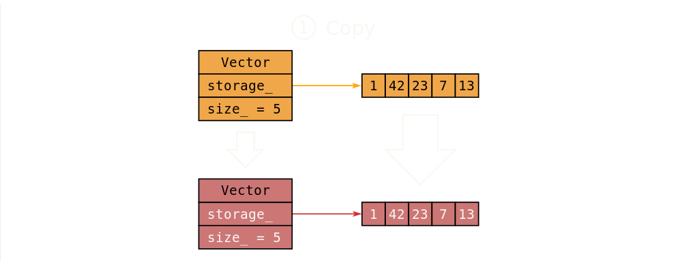
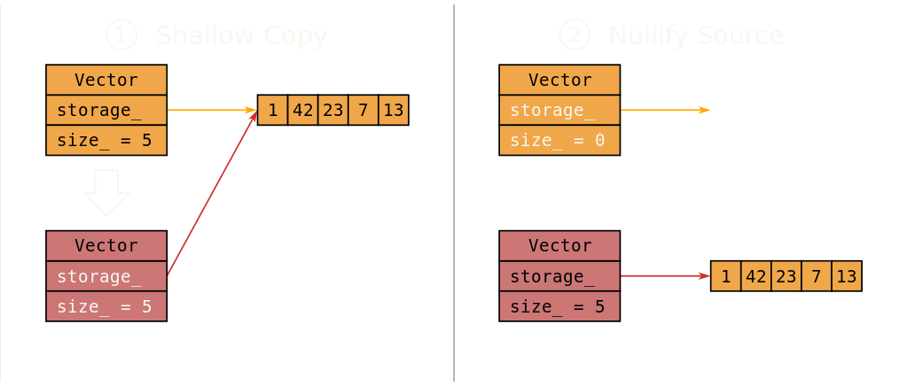

# 一、右值引用

[(28条消息) C++11 - 右值引用_大秦坑王的博客-CSDN博客](https://blog.csdn.net/QIANGWEIYUAN/article/details/88653747)

[详解C++右值引用 - jiu~ - 博客园 (cnblogs.com)](https://www.cnblogs.com/jiu0821/p/7920837.html)

## 1. 右值引用的概念

首先复习一下左值引用：**左值是一个指向某内存空间的表达式，并且我们可以用&操作符获得该内存空间的地址。右值就是非左值的表达式。**

```C++
int a = 10;
int &b = a; 	// 左值引用
```

而左值引用是无法引用右值的。

```C++
int &b = 20; 	// error
```

解决办法1，是让 b 也变为一个常量。但这样一来，我们就无法修改 b 的数据了。

```C++
/*
这里temp是在内存上产生的临时量
const int temp = 20; 
const int &b = temp;
*/
const int &b = 20;
```

解决办法2，右值引用。

```C++
/*
这里temp是在内存上产生的临时量
int temp = 20; 
int &b = temp;
*/
int &&b = 20;
```

> const int &b=20和int &&b=20在底层指令上是一模一样的，没有任何区别，不同的是，通过右值引用变量，可以进行读操作，也可以进行写操作。


## 2. 为什么要有右值引用：移动语义

### 2.1 浅拷贝和深拷贝

我们在构造一个类的时候，经常会遇到这样一个问题。

```C++
Array a;
Array b(a);		// 拷贝构造函数
Array b = a;	// 赋值运算符
```

如果Array的成员变量中使用了指针，那么就会出现浅拷贝的问题：**两个对象的成员指针指向同一个资源，析构时同一个资源被delete两次，代码运行崩溃**。

解决办法就是给Array提供自定义的拷贝构造函数和operator=赋值重载函数，实现深拷贝。

```C++
// 拷贝构造函数
Array::Array(const Array &arr){  //拷贝构造函数
    this->m_len = arr.m_len;
    // 深拷贝
    this->m_ptr = new int[this->m_len];
    memcpy(this->m_ptr, arr.m_ptr, m_len * sizeof(int) );
}

// 栈的赋值重载函数
Array::Array& operator=(const Array &arr)
{
    if (this == &src)
        return *this;

    delete[]m_ptr;
	
    this->m_len = arr.m_len;
    // 深拷贝
    this->m_ptr = new int[m_len];
    memcpy(this->m_ptr, arr.m_ptr, sizeof(int)*m_len);
    
    return *this;
}
```


### 2.2 左值引用的问题

考虑这么一种情况：某个函数返回一个 `Array` 对象，另一个 `Array` 对象在函数外接收它。

```C++
Array process()
{
	// 这里构造新的局部对象b
	Array b;
	/*
	因为b是函数的局部对象，不能出函数作用域，
	所以这里b需要拷贝构造生成在main函数栈帧上
	的临时对象，因此这里会调用拷贝构造函数，完成
	后进行b局部对象的析构操作
	*/
	return b;
}
int main()
{
	Array a;
	/*
	process()返回的临时对象给a赋值，该语句结束，临时对象
	析构，所以此处调用operator=赋值重载函数，然后调用
	析构函数
	*/
	a = process();
	return 0;
}
```

上面的代码虽然解决了对象的浅拷贝问题，但是效率却非常的低下，主要在这两句代码上：

1. `return b;`

这句代码中，b是函数的局部对象，因此不能出函数作用域，所以系统会创建一个临时对象 tmp，并调用拷贝构造。然后b对象由于出了作用域，所以会被析构。所以 `return b` 相当于做了下面两句话：

```C++
Array tmp(b);	// 拷贝构造生成临时对象
~Array(); 		// b被析构
```

2. `a = process();`

这句代码中，会调用 a 的赋值运算符，将临时对象 tmp 拷贝给 a，然后临时对象 tmp 会被析构。相当于下面两句话：

```C++
a = tmp;	// 调用a的赋值运算符
~Array();	// tmp 被析构
```


**这两句代码为什么会出现效率问题呢？**原因就在于我们的拷贝构造和赋值运算使用的是深拷贝。

深拷贝需要给对象重新开辟内存，然后再将需要拷贝的对象拷贝过来：

```C++
// 深拷贝
this->m_ptr = new int[m_len];		
memcpy(this->m_ptr, arr.m_ptr, sizeof(int)*m_len);
```

以`a = process();`为例，这会出现如下情况：

```C++
a.m_ptr = new int[m_len];	// 为a开辟新的内存
memcpy(a.m_ptr, tmp.m_ptr, sizeof(int)*m_len); // 将tmp的数据拷贝到a中
~Array();	// tmp被析构
```

既然tmp最后要被析构，我们为什么不能将tmp持有的内存资源直接交给a呢？这样效率就能大大提高了，即如下逻辑：

```C++
a.m_ptr = tmp.m_ptr;	// 将tmp持有的内存资源直接交给a
tmp.m_ptr = nullptr;	// tmp指针指向空，防止被析构两次
~Array();	// tmp被析构
```

然而我们的拷贝构造函数不可能写成这个形式，我们必须要想一种方法，让程序在特殊的情况下能够调用上面这种拷贝方式。这就要用到我们的右值引用了。


### 2.3 右值引用的拷贝构造和赋值运算符

```C++
// 移动构造函数
Array::Array(Array &&arr){  //拷贝构造函数
    this->m_len = arr.m_len;
    // 直接拷贝
    this->m_ptr = arr.m_ptr;
    arr.m_ptr = nullptr;
}

// 移动赋值函数
Array::Array& operator=(Array &&arr)
{
    if (this == &src)
        return *this;

    delete[]m_ptr;
	
    this->m_len = arr.m_len;
    // 直接拷贝
    this->m_ptr = arr.m_ptr;
	arr.m_ptr = nullptr
        
    return *this;
}
```

如果我们加上 右值引用的拷贝构造和赋值运算符（也称为移动构造函数和移动赋值函数），那么当我们执行 `a= process()` 这一句代码时，临时变量由于没有变量名，属于右值，那程序就会执行右值引用的拷贝构造函数，这样就实现了上面的功能。


### 2.4 返回值优化

[C++之返回值优化 - 简书 (jianshu.com)](https://www.jianshu.com/p/f3b8c3e4f2ad)

**`return b;` 这一句代码又是如何找到右值引用的赋值函数呢？** 这就要提到**返回值优化**了。

```C++
Array process(){
	Array b;
	return b;
}
```

为了解决上述问题，编译器会进行返回值优化。如果开启了返回值优化，那么当编译器识别出了需要返回的临时对象 tmp 与对象 b 一致，那么编译器就会将二者直接关联在一起，意思就是对 b 操作相当于直接对临时对象 tmp 操作，因而编译器处理后的代码应该是这样的：

```C++
Array process(Array &tmp){
	Array tmp;
	return tmp;
}
```

这样就省下一一次拷贝构造的过程。


### 2.5 移动语义

[认识C++移动语义与右值引用 - 知乎 (zhihu.com)](https://zhuanlan.zhihu.com/p/347977300#:~:text=如前文所言，移动语义意味着把对象持有的资源或内容转移给另一个对象。 此处，对,std%3A%3Aexchange () 的使用也值得留意。)

**移动语义的“移动”，意味着把某对象持有的资源或内容转移给另一个对象。** 

例如我们需要将一个 vector 对象 vec_orange 中的内容移动到另一个 vector 对象 vec_red  中。

+ 一种比较差的做法就是：为 vec_red  开辟一段内存空间，将 vec_orange 中的内容拷贝到 vec_red  中。但是我们需要的是移动而不是拷贝！！所以这种做法效率低下。

```C++
std::vector<int> vec_orange = { 1, 42, 23, 7, 13 };
std::vector<int> vec_red = vec_orange;
```



图源：[Moves demystified (kholdstare.github.io)](https://kholdstare.github.io/technical/2013/11/23/moves-demystified.html)

+ 而移动语义的做法是：直接将 vec_red  中的指针指向 vec_orange 的内存空间，然后将 vec_orange 中的指针置空。这样就很好得实现了移动！

```C++
std::vector<int> vec_orange = { 1, 42, 23, 7, 13 };
std::vector<int> vec_red = std::move(vec_orange);
```




图源：[Moves demystified (kholdstare.github.io)](https://kholdstare.github.io/technical/2013/11/23/moves-demystified.html)

可以发现我们上面讲的 **移动构造函数 ** 和 **移动赋值函数** 就是实现了 **移动语义**。

而上面的 `std::move()` 方法是为了将 vec_orange 从左值转为一个右值引用，从而能够匹配到移动赋值函数。


## 3. 右值引用解决的另一个问题：完美转发

[C++11完美转发及实现方法详解 (biancheng.net)](http://c.biancheng.net/view/7868.html)

### 3.1 什么是完美转发？

完美转发指的是函数模板可以将自己的参数“完美”地转发给内部调用的其它函数。**所谓完美，就是说这个参数好像没有经过函数模版，而直接传入了其他函数中一样。**（左、右值属性也不能改变）

```C++
template<typename T, typename Arg>
shared_ptr<T> factory(Arg arg){
	return shared_ptr<T>(new T(arg));
}
```

显然，上面这个函数模版并不是完美的。

1. 这个函数使用的是值传递，所以会额外进行一次拷贝操作。
2. 这个函数不能接收右值作为参数。

第一种情况可以利用**引用**来解决：如果使用引用的话，就无需进行额外的拷贝操作。

```C++
template<typename T, typename Arg>
shared_ptr<T> factory(Arg &arg){
	return shared_ptr<T>(new T(arg));
}
```

**如何接收右值呢？** 可以重载一个函数，接受 const 引用。

const 左值引用既可以接受左值，也可以接收右值

```C++
//接收左值参数
template<typename T, typename Arg>
shared_ptr<T> factory(Arg &arg){
	return shared_ptr<T>(new T(arg));
}

//接收右值参数
template<typename T, typename Arg>
shared_ptr<T> factory(Arg const &arg){
	return shared_ptr<T>(new T(arg));
}
```

但这种办法仍有两个问题：

1. 如果函数的参数有很多个，那么就需要针对每个参数都要写const引用和non-const引用的重载，这会导致代码变得出奇长
2. 这种办法仍不是完美转发，因为它不能实现移动语义。也就是说，无论调用函数时传递进去的是左值还是右值，对于函数的内部参数 arg 来说，它有它自己的名称，可以获取它的存储地址，所以 arg 永远是左值。所以调用 `T(arg)` 的时候永远都只能进入拷贝构造函数而不是移动构造函数。

而用右值引用可以很好地解决上面的问题。


### 3.2 引用折叠

+ C++11 标准里面引入了引用折叠规则：

```C++
A& & => A&
A& && => A&
A&& & => A&
A&& && => A&& 		// 只有这种情况是右值！
```

+ 针对这样的模版有如下的规则：

```C++
1 template<typename T>
2 void foo(T&&);
```

1. 当函数foo的实参是一个`A`类型的左值时，T的类型是 `A&`。再根据引用叠加规则判断，最后参数的实际类型是 `A&`。
2. 当foo的实参是一个`A`类型的右值时，T的类型是`A`。根据引用叠加规则可以判断，最后的参数类型是 `A&&`。


+ 引用折叠的规则可以完美解决左右值接收的问题：

```C++
template<typename T, typename Arg>
shared_ptr<T> factory(Arg &&arg){
	return shared_ptr<T>(new T(arg));
}
```

**无论我们传入的参数是左值还是右值，arg都可以接收。**

**那么在函数内部如何识别参数原来是左值还是右值呢？** 用 forword 函数


### 3.3 模板函数 `std::forword<T>()`

`std::forword` 定义如下：

```C++
1 template<class S>
2 S&& forward(typename remove_reference<S>::type& a) noexcept
3 {
4   return static_cast<S&&>(a);
5 }
```


### 3.4 右值引用实现完美转发

```C++
template<typename T, typename Arg>
shared_ptr<T> factory(Arg&& arg){
   return shared_ptr<T>(new T(std::forward<Arg>(arg)));
}
```

我们来看看上面的程序是如何解决完美转发问题的？

（1）假设传入的参数是左值：

```C++
X x;
factory<A>(x);
```

那么根据模版的规则，代码会变成这样：

```C++
shared_ptr<A> factory(X& && arg){
   return shared_ptr<A>(new A(std::forward<X&>(arg)));
}
 
X& && forward(remove_reference<X&>::type& a) noexcept{
   return static_cast<X& &&>(a);
}
```

根据引用折叠，`factory(X& && arg)` 会变为 `factory(X& arg)`：

```C++
shared_ptr<A> factory(X& arg){
   return shared_ptr<A>(new A(std::forward<X&>(arg)));
}
 
X& && forward(remove_reference<X&>::type& a) noexcept{
   return static_cast<X& &&>(a);
}
```

`std::forward` 函数进行引用叠加，并求得remove_reference的值后，代码最后变成了这样：

```C++
// 最终版本
shared_ptr<A> factory(X& arg){
   return shared_ptr<A>(new A(std::forward<X&>(arg)));
}
 
X& forward(X& a) noexcept{
   return static_cast<X&>(a);
}
```

这对于左值来说当然是完美转发：通过两次中转，参数`arg` 被传递给了 `A` 的构造函数，这两次中转都是通过左值引用完成的。

（2）假设传入的是右值

```C++
X foo();
factory<A>(foo());
```

根据推导得到：

```C++
// 最终版本
shared_ptr<A> factory(X&& arg){
   return shared_ptr<A>(new A(std::forward<X>(arg)));
}
 
X&& forward(X& a) noexcept{
   return static_cast<X&&>(a);
}
```

对右值来说，这也是完美转发：参数通过两次中转被传递给A的构造函数。另外对A的构造函数来说，它的参数是个被声明为右值引用类型的表达式，并且它还没有名字。那么根据规则可以判断，它就是个右值。这意味着这样的转发完好的保留了move语义，就像factory函数并不存在一样。

> [详解C++右值引用 - jiu~ - 博客园 (cnblogs.com)](https://www.cnblogs.com/jiu0821/p/7920837.html)
>
> 事实上std::forward的真正目的在于保留move语义。如果没有std::forward，一切都是正常的，但有一点除外：A的构造函数的参数是有名字的，那这个参数就只能是个左值。
>
> 如果你想再深入挖掘一点的话，不妨问下自己这个问题：为什么需要remove_reference？答案是其实根本不需要。如果把`remove_reference<S>::type&`换成`S&`，一样可以得出和上面相同的结论。但是这一切的前提是我们指定Arg作为std::forward的模版参数。remove_reference存在的原因就是强迫我们去这样做。


